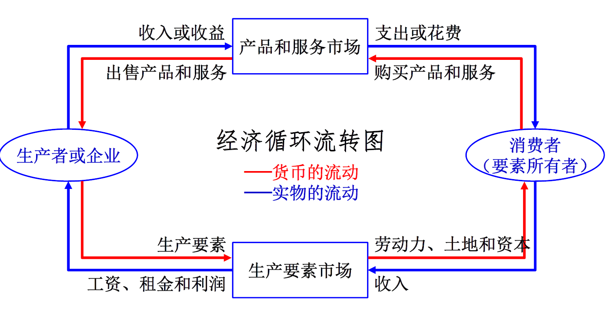

<head>
    
    
    </head>
# 经济管理

### Chapter 1

1. 经济问题：是**人类需求/欲望的无限性**与**经济资源的稀缺性**的矛盾产物

2. 经济学研究的四个基本问题：生产什么、如何生产、为谁生产、经济总量问题（前三个微观，最后一个宏观）

3. 经济体制分为自给经济、市场经济、计划经济、混合经济，其资源配置和利用的方式分别为：

   **自给经济**：习惯和传统

   **市场经济**：市场机制

   **计划经济**：指令性经济和行政命令

   **混合经济**：市场和计划相结合（社会主义市场经济）

4. 经济学研究的最基本假设：“**理性**经济人，具有**利己**的理性”

5. 管理的基本职能：**计划**职能、**组织**职能、**领导**职能、**控制**职能

6. 管理的环境：内部环境和外部环境（分为任务环境和一般环境）

7. 管理者的技能：概念技能、人际技能、技术技能

8. 现代经济学说的发展：启蒙阶段（重商主义、重农学派 古典学派 → 新古典主义 → 凯恩斯主义 → 后凯恩斯时代

   著名人物：威廉.配第：早期古典政治经济学,奠定了基本的经济学研究方法，亚当斯密：现代经济学之父，凯恩斯：宏观经济学之父

   约翰.穆勒：古典经济学的集大成者，卡尔.马克思：社会主义的缔造者，李嘉图：劳动价值体系，马歇尔：新古典经济学的奠基者

9. **本章小结**

   - 对经济、管理的理解

   - 人类欲望的无限性和资源的稀缺性

   - 经济学研究的基本问题

   - 理性经济人假设

   - 管理的基本概念

   - 管理的职能、环境

   - 管理者技能

   - 经济学说的演变历程

   - 管理学的发展历史

### Chapter 2

1. 微观经济学的核心是**均衡价格理论**

2. 消费者、生产者与市场之间的经济联系

   

3. **影响商品需求量的主要因素：**

   - 核心：价格（P）
   - 消费者的收入水平（I）
   - 相关商品的价格（Pr）
   - 消费者的偏好（T）
   - 消费者对商品的未来价格预期（E）
   - 其他影响因素（O）

4. 需求函数、需求曲线、需求定律

   - 需求函数：影响商品需求量的各因素视为自变量，需求量视为因变量，得到需求量与各因素之间的函数关系
     $$
     Q_D=f(P,I,P_r,T,E,O)
     $$
     线性形式是广泛使用的一种需求函数
     $$
     Q_D=a+b_PP+b_II+b_{P_r}P_r+b_TT+b_EE+b_OO
     $$
     一般重点考虑**需求量与自身价格**的函数关系
     $$
     Q_D=a+b_PP
     $$
     正常商品的$b_P$一般<0,即价格和需求量反相关

   - 需求曲线：微观经济分析通常以纵轴表示价格（自变量），以横轴表示需求量（因变量）

   - 需求定律：需求曲线向右下方倾斜，即：商品的需求量与价格呈反方向变化  解释：替代效应和收入效应

   - 特殊低档品：吉芬品，总需求随价格上升而上升

5. 区分**需求量的变动**和**需求的变动**：

   需求量是某个数值，需求是一种关系

   - 需求量的变动：因商品自身价格的变化而引起的需求量的变化，即（价格，需求）坐标点在曲线上的移动
   - 需求的变动：其他因素所引起的需求曲线的平移

6. **需求弹性**：衡量商品的需求量变动对影响因素变化的反应程度，一般分为价格弹性、收入弹性和交叉价格弹性

7. **需求的价格弹性**：
   $$
   需求的价格弹性=\frac{需求量变动百分比}{价格变动百分比}
   $$
   价格弧弹性（曲线上两点之间）
   $$
   E_P=\frac{\Delta Q/Q}{\Delta P/P}=\frac{\Delta Q}{\Delta P}\cdot\frac{P}{Q}
   $$
   价格点弹性（曲线上某一点）
   $$
   Ep=\lim_{\Delta P\rightarrow0}\frac{\Delta Q/Q}{\Delta P/P}=\frac{dQ}{dP}\cdot\frac{P}{Q}
   $$
   需求的价格弹性的五种类型

   

   特殊：线性需求曲线——斜率不变，但价格弹性是变化的

   

   需求价格弹性的应用：对于富有弹性的商品，销售总收益与商品的价格成反方向变动；对于缺乏弹性的商品，销售总收益与商品的价格成同方向变动；对于单位弹性的商品，降低价格或提高价格对厂商的销售总收益都没有影响

8. **需求的收入弹性**

   弧弹性和点弹性公式分别为
   $$
   E_I=\frac{\Delta Q/Q}{\Delta I/I}=\frac{\Delta Q}{\Delta I}\cdot \frac{I}{Q}(变化量比值/绝对量（平均数）比值)\\
   E_I=\lim_{\Delta I\rightarrow0}\frac{\Delta Q/Q}{\Delta I/I}=\frac{dQ}{dI}\cdot\frac{I}{Q}
   $$
   低档品：收入弹性为负值

   正常品：收入弹性为正值

   恩格尔定律：家庭或国家越富裕，食物需求的收入弹性就越小

9. **需求的交叉价格弹性**

   弧弹性和点弹性公式分别为
   $$
   E_{XY}=\frac{\Delta Q_X/Q_X}{\Delta P_Y/P_Y}=\frac{\Delta Q_X}{\Delta P_Y}\cdot\frac{P_Y}{Q_X}\\
   E_{XY}=\lim_{\Delta P_Y\rightarrow0}\frac{\Delta Q_X/Q_X}{\Delta P_Y/P_Y}=\frac{\Delta Q_X}{\Delta P_X}\cdot\frac{P_Y}{Q_X}
   $$
   互为替代品：交叉价格弹性为正

   互为互补品：交叉价格弹性为负

   相互独立：交叉价格弹性为零

   交叉价格弹性的应用：制定价格、反映了产品之间的竞争关系、经济行业划分：绝对值大说明相关度大，反之相关度小

10. **影响商品供给量的主要因素**：

    - 商品自身价格（P）
    - 生产成本（C）
    - 相关产品的价格（Pr）
    - 生产的技术水平（T）
    - 生产者的未来价格预期（E）

11. 供给函数、供给曲线、供给定律
    $$
    Q_s=f(P,C,P_r,T,E,O)
    $$
    只考虑商品**供给量与自身价格**的线性对应关系时
    $$
    Q_s=c+d_PP
    $$
    供给曲线类似于需求曲线

    供给定律：除土地、劳动力等一些特殊的生产资源（土地与横坐标垂直）供给曲线向右上方倾斜，表明一般商品的供给量与价格呈同方向变化

12. 区分**供给量变动**和**供给变动**：与5.类似

13. **市场供给弹性分析：**

    价格弹性：与需求弹性的分析类似

    价格弹性的影响因素：

    - 产量调整需要的时间
    - 生产成本随产量变化的情况
    - 商品生产周期的长短

    交叉价格弹性：与需求弹性的分析类似；对于政府制定经济政策非常重要

    成本弹性：一般为负值

14. 商品的**均衡价格**与**均衡数量**（将供给函数和需求函数叠加）

    需求和供给相等时的价格称为均衡价格，此时的数量即为均衡数量

15. 均衡的移动：需求增加，需求曲线右移，均衡价格和均衡数量均增加，反之均减少；

    供给增加，供给曲线右移，均衡价格下降，均衡数量增加，反之均衡价格上升，均衡数量减少

16. 供求定理：在其他条件不变的情况下，需求的变动分别引起均衡价格和均衡数量同方向的变动；

    供给的变动引起均衡价格反方向的变动，引起均衡数量同方向的变动

17. 市场均衡与价格政策：

    - 价格控制：规定价格上限、规定价格下限、政府控制价格的放开
    - 价格补贴与税收：征税和补贴的影响、税收归宿问题

18. **本章小结**

- 消费者、生产者和市场之间的经济联系

- 需求及其表达

- 市场需求弹性分析

- 供给及其表达

- 市场供给弹性分析

- 市场均衡原理

- 价格控制、补贴、税收等政府政策分析

### Chapter 3

1. 要素投入与生产函数

   四大生产投入要素：劳动力，资金、土地、管理

   生产函数：投入产出的对应关系

2. **边际报酬递减律**

   平均产量AP(average production):$AP=\frac{Q(x)}{x_i}$

   边际产量（一般指单一要素）:当其他要素投入不变时，增加某生产要素单位投入所引起的总产量的变化
   $$
   MP_{x_i}=\frac{\Delta Q(x)}{\Delta x_i}=\frac{\delta Q(x)}{\delta x_i}
   $$
   生产实践表明：若连续等量地把某一种可变生产要素增加到生产系统而维持其他生产要素的投入不变，那么当这一要素总投
   入量**超过某个临界值**时，增加该要素一个单位的投入，其**边际产量**会逐渐减少，这个现象称为**边际报酬递减**

   边际报酬递减的直观意义就是：产出函数的切线斜率不断变小

   边际产量和平均产量的交点，就是平均产量的最大点，证明过程：
   $$
   AP=\frac{Q(x)}{x}\xrightarrow[]{两边求导数} \frac{dAP}{dx}=\frac{dQ(x)/dx}{x}-\frac{Q(x)}{x^2}
   $$
   规模报酬：因为要素（所有要素）的投入规模变化而导致的产量的变动称为规模报酬

   

3. 等产量线和生产要素可替代性

   **等产量线**：产量相等的生产要素组合形成的曲线，即总产量函数的等高线/等值线，一般凸向原点且距离原点越远的等产量线对应的产量越大；两条等产量线不相交；等产量线向右下方倾斜（联想反比例函数）；

   **生产要素可替代性**：增加其中之一的投入而减少其他对应要素投入，可以维持相同的产出

   - 生产要素之间可完全相互替代：等产量线是直线，要素间的替代率是一个定值
   - 生产要素之间不完全替代：要素之间的替代率不恒定，等产量线是凸向原点的曲线（比值不确定，每个点的微分不同）
   - 生产要素之间完全不能替代：等产量线是直角折线

   **边际技术替代率（MRS）：**维持产量不变时，要素x 减少单位数量所应该增加的y 的投入量，表示单位x 可抵多少y，是等产量线上两种生产要素变化量（绝对值）之比，即两种商品边际产量的比值
   $$
   MRS=\left| \frac{\Delta y}{\Delta x} \right|=\left| \frac{dy}{dx} \right| \\
   \left| dx \right|\cdot MP_x=\left|dy\right|\cdot MP_y\Rightarrow MRS=\frac{\left|dy\right|}{\left|dx\right|}=\frac{MP_x}{MP_y}
   $$

4. 等成本线：给定预算`C`(有限资源),要素`x`,`y`的购进价格分别为`Px`,`Py`
   $$
   P_xx+P_yy=C（成本越低，越靠近原点）
   $$
   
5. **投入要素最佳组合**

   - **产量最大决策**：方法：找一条等产量线，使之与给定预算的等成本线相切，切点就是生产要素最佳组合点
     $$
     \frac {MP_x}{P_x}=\frac {MP_y}{P_y}（可推广到多个要素的情况）
     $$
     
   - **成本最小决策**：方法：找一条等成本线，使之与给定的等产量线相切，切点就是生产要素最佳组合点
     $$
     \frac{MP_1}{P_1}=\frac{MP_2}{P_2}=\cdots=\frac{MP_n}{P_n}
     $$

6. **成本函数**

   技术水平和要素价格不变的情况下，成本与产出量x之间的相互关系：$TC=C(x)$

   线性成本函数：$TC=F+vx$

   也能有非线性成本函数如$TC=a+bx+cx^2$

   平均成本：总成本与总产量之间的比值：$AC=\frac {C(x)}{x}$

   边际成本：增加单位产量而引起的成本增加：$MC=\frac{\Delta C(x)}{\Delta x}=\frac {dC(x)}{dx}$

   类似于边际产量，**边际成本**和**平均成本**的交点是**平均成本最低点**

7. 利润函数与**利润最大化**

   利润等于收益减去成本之后的剩余

   收益：销售价格乘销售量：$TR(Q)=P\times Q$

   利润函数：$\Pi = TR(x)-TC(x)$

   **利润最大的必要条件**可从一阶微分得到：
   $$
   \frac{d\Pi}{dx}=0\Rightarrow \frac{dTR(x)}{dx}=\frac{dTC(x)}{dx}\\
   即边际收益MR=边际成本MC
   $$
   完全竞争市场的边际收益等于市场价格，因此利润最大的必要条件是：$P=MC$

8. 线性收益/成本函数的边际分析

   **额外产量决策**（成本函数变化，收益函数不变）：
   $$
   \Pi'=P(x+x')-(F+vx+v'x')\\
   结论：只要边际收益P大于边际成本v',就可以增加产量
   $$
   **降价促销决策**（成本函数和收益函数都变）若降价后$MR'<MC'$则不再增产

9. 盈亏平衡分析

   盈亏平衡点：企业的成本刚好等于收入，从而利润等于零的状态

   简单线性盈亏平衡点：$x_0=\frac{F}{P-v}$

   盈亏平衡与生产技术选择：需要根据盈亏平衡点和实际销售量的关系来选择合适的生产技术方案

10. 市场结构：买主和卖主数量的多少（**规模**）、产品之间相互差异的程度（**细分度、丰富度**）以及新的生产者进入市场的难易程度（**竞争性**）

    有四类市场结构：

    |          | 卖者数量 | 产品性质   | 长期市场进入 |
    | -------- | -------- | ---------- | ------------ |
    | 完全竞争 | 大量     | 同质       | 容易         |
    | 垄断竞争 | 较多     | 差异       | 容易         |
    | 寡头垄断 | 少数     | 同质或差异 | 有障碍       |
    | 完全垄断 | 一个     | -          | 不能进入     |

11. 完全竞争市场的供给曲线

    边际收益等于市场价格P

    企业要根据市场价格和自身的成本函数，确定使利润最大的产量Q，该产量就是企业的供给量
    $$
    P=MC=\frac{dC(x)}{dx}|_{x=Q}
    $$
    另外为了保证到达一定产量时盈利为正，**平均变动成本必须小于市场价格**，于是供给曲线就是边际成本MC位于平均变动成本线以上的增函数部分

12. 不完全竞争市场的生产决策

    - 完全垄断时价格是销量的函数，总收益不再是线性函数，边际收益也不再等于价格，但利润最大化的条件依然不变，可根据“边际收益=边际成本”确定最优产量

      和完全竞争不同，**垄断价格会高于边际收益和边际成本**

    - 寡头垄断与垄断竞争：企业不能完全控制价格，需要使用**博弈论**等更高级分析手段

    - 垄断的低效率与社会损失：

      **帕累托改进**：不损害别人利益的情况下，使某个或某些人利益增加，称为帕累托改进

      **帕累托最优/帕累托有效**：如果一个系统，不存在某个方案能实现帕累托改进，则称该系统达到了帕累托最优/有效；从全社会来看，垄断产量不是社会资源的帕累托最优配置

      结果：垄断使企业处境好，竞争使消费者处境好

13. 市场失灵的原因包括：不完全竞争、产品外部性；非对称信息/不完全信息和公共产品问题

14. **本章小结**

- 生产函数

- 要素最佳组合

- 切点条件

- 利润函数

- 利润最大化的一阶必要条件

- 完全竞争市场的利润决策和供给曲线

- 垄断厂商的生产决策

- 垄断的低效率和损失

- 市场失灵的原因

### Chapter 4

1. 宏观经济学的研究对象：总产出、通货膨胀、失业、宏观经济政策

2. **GDP核算**的注意点：

   - GDP核算的是最终产品的市场价值
   - GDP是一定时期内生产的最终产品价值,并非单纯出售的产品价值
   - GDP是流量而非存量
   - GDP核算的是市场价值

3. GDP与GNP: GNP强调**国民**概念,GDP强调**地域**概念

4. GDP的核算方法:

   - 生产法:把一段时间内生产服务活动的价值增值加总求和(不常用)

   - 收入法:通过核算一定时期内获得的收入来计算GDP

     收入法GDP=工资+租金+净利息+非公司企业收入与公司税前利润+企业间接税和企业转移支付+折扣

   - **支出法**(我国采用的GDP核算方法):从社会对产品的消费角度出发，把当期用以购买最终产品和劳务的货币加总
     $$
     支出法GDP=消费C+投资I+净出口NX+政府购买G
     $$

5. $名义GDP=当年产量*当期价格$

   $真实GDP=当期产量*基准期价格$

   名义GDP与真实GDP之比称为GDP平减指数
   $$
   真实GDP增长率=\frac{当年的真实GDP-前一年的真实GDP}{前一年的真实GDP}\times100\%
   $$

6. 失业者的条件:

   - 有劳动能力
   - 愿意就业
   - 现在没有工作

   $$
   失业率=\frac{失业人口数}{劳动力人口数}\times 100\%
   $$

7. 失业的分类:

   - 自然失业:等于摩擦性失业和结构性失业之和
   - 周期失业

   只有自然失业,没有周期性失业的经济状态,称为**充分就业**(充分就业并不意味着每个劳动人口都有工作)

8. 消费物价指数`CPI`与通货膨胀率
   $$
   CPI=\frac{一篮子固定商品当期价格}{一篮子商品基期价格}\times 100\% \\
   第t年的通胀率=\frac{第t年CPI-第t-1年CPI}{第t-1年CPI}\times 100\%
   $$
   (`WPI`是大宗物资批发价格加权平均得到的价格指数,通常可以通过观察`WPI`的变动情况来对`CPI`变化趋势进行预测)

9. 经济的短期波动称为经济周期,一般分为衰退和扩张两个主要阶段

10. 宏观经济政策:**财政政策+货币政策**

    财政政策:国家调节政府的支出与收入水平

    货币政策:中央银行通过控制货币市场中货币供应量、以及调节利率进而影响投资和整个经济支出以达到一定经济目标

11. 简单情况下,货币乘数=1/存款准备金率

12. 货币政策的使用:

    - 出现经济衰退时,采取扩张性货币政策
    - 出现需求拉动型通货膨胀时,采取紧缩性货币政策
    - 实际操作中,政府常常会将财政政策和货币政策混合搭配使用

13. 本章小结

- 宏观经济学的产生与发展

- 宏观经济学的主要研究对象

- GDP及其测算方法

- 失业

- 通货膨胀

- 经济周期

- 财政政策

- 货币政策

### Chapter 5&6

1. 人名：泰勒 **科学管理之父**

2. 管理的职能：**计划、组织、指挥、协调、控制**

3. 马斯洛需要层次理论：**生理需要、安全需要、情感与归属需要、尊重需要、自我实现需要**

4. 双因素理论-赫茨伯格：保健因素、激励因素

5. 组织结构设计：

   - 管理跨度：管理人员能直接管理的下属的数量

   - 给定总人数，管理跨度与组织层次数成反比

### Chapter 7

1. 企业类型：独资企业、合伙企业、公司制企业、合作制企业
2. 企业制度：产权制度、组织制度、管理制度
3. 公司制企业的法人治理结构：股东大会、董事会、监事会、执行层

### Chapter 8

1. 产品开发的驱动方式
   - 市场拉动模式
   - 技术推动模式
   - 竞争推动模式
2. 面向顾客的产品设计：用户为中心、价值分析、顾客满意度、顾客参与设计
3. 面向制造与装配的产品设计：制造、装配、标准化、通用化、模块化

### Chapter 9

1. 组织结构设计：
   - 职能型组织：资源效率高，流程效率低
   - 流程型组织：流程效率高，资源效率低
   - 复合型组织（类似于矩阵式）：整体效率的优化
2. 生产线布置的基本形式：
   - 工艺式
   - 对象式
   - 固定式
   - 成组布置（介于工艺式与对象式之间）
3. 生产管理方式：
   - 备货生产（推式生产）
   - 按单生产（拉式生产）
4. 推/拉过程的过渡点，称为**客户定制分离点**
5. 五类基本生产系统：单件小批型、批量流水型、节拍流水型（人工节拍流水型、机器节拍流水型）、流程型
6. **结构-功能悖论**：没有哪种生产类型能同时在物流连续性（效率）和应变能力（柔性）两方面都达到最高水平
7. 世界级制造系统（一定程度上解决了“结构-功能悖论”）：$CIMS$（计算机集成制造）、$JIT$（准时制生产）

### Chapter 10

1. 需求变化的影响因素：趋势因素、季节性因素、周期性因素、随机因素

2. 预测模型：

   - **移动平均法**：对于 变化比较平稳的需求 可使用最近几个时期的历史需求的平均值作为下一个时期的需求值

   - **指数平滑法**：
     $$
     第t期预测值=第t-1期预测值+平滑系数\times 第t-1期预测误差\\
     第t-1期预测误差=第t-1期实际值-第t-1期预测值
     $$
     平滑系数一般在0.1-0.2之间 代表了趋势变动占总误差的百分比

3. 物料需求计划$MRP$(推式生产)

   准时制生产$JIT$(拉式生产)：“零库存”管理

4. $JIT$的实现方式——**看板管理**：生产看板与搬运看板

5. 供应链运作：计划、采购、制造、交付

### Chapter 12

1. `AON`:单代号网络图:用节点表示项目工作,用箭头表示工作之间的先后关系

   `AOA`:双代号网络图:用箭头表示工作,用节点表示工作的开始和结束

2. **关键路径法**(`CPM`)的7个时间参数

   - 工作持续时间`DU`
   - 最早开始时间`ES`
   - 最早完成时间`EF`
   - 最晚开始时间`LS`
   - 最晚完成时间`LF`
   - 总浮动时间`TF`(不耽误项目总工期)
   - 自由浮动时间`FF`(不延误紧后工作的最早开始时间)

   关系:$EF=ES+DU\\LF=LS+DU\\TF=LS-ES=LF-EF$

   

3. 四种时间依赖的逻辑关系

   - 完成->开始时间差`FS`
   - 完成->完成时间差`FF`
   - 开始->开始时间差`SS`
   - 开始->完成时间差`SF`

4. **基本成本指标**

   - 完工预算`BAC`
   - 计划值`PV`:$PV=BAC\times 完成比例$
   - 实际成本`AC`:已完成的工作消耗的实际费用
   - 挣得值`EV`:$EV=BAC\times 实际完成的比例$

5. **成本绩效指标**

   - 成本偏差`CV`:$CV=EV-AC$
   - 成本绩效指标`CPI`:$CPI=\frac{EV}{AC}$
   - $CV<0$或者$CPI<1$表示成本超支

6. **进度绩效指标**

   - 进度偏差`SV`:$SV=EV-PV$
   - 进度绩效指标`SPI`:$SPI=\frac{EV}{PV}$
   - $SV<0$或$SPI<1$表示进度延迟

7. **完工估算**`EAC`
